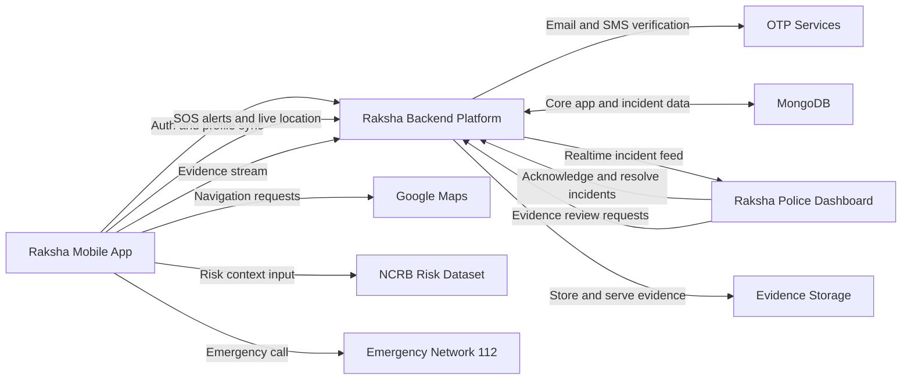

# Raksha System Architecture (Slide Version)

> If your Mermaid tool expects raw diagram text (for example `mmdc`), use
> `SYSTEM_ARCHITECTURE_FLOWCHART.mmd` instead of this markdown file.

## Purpose
- Presentation-friendly architecture view with high-level flows only.
- No endpoint or API-level details.

## System Flowchart (Mermaid)

## Notes
- Backend remains the integration hub between mobile app and police dashboard.
- OTP Services represent both email OTP and SMS OTP providers.
